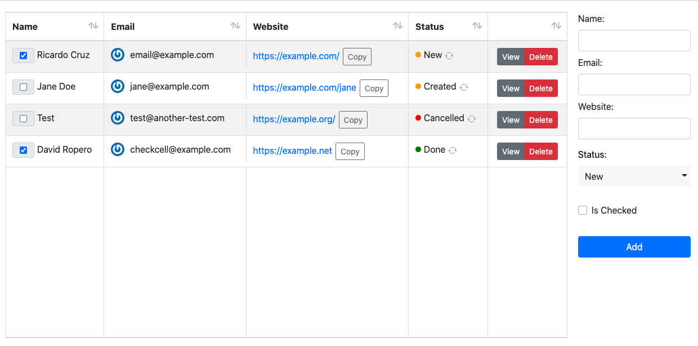

# Cell Renderers for your next Xojo Web 2 project

Enhance your WebListView controls using these cell renderers.


## Installation
1. Clone or download this repository
2. Open CustomCellRenderers.xojo_project with [Xojo](https://www.xojo.com/)
3. Drag & Drop `Cell Renderers` folder into your project
4. Done!, you can use them already!

## Usage
You can open the project itself as an example, it contains a simple web page with the working code.

## Available Cell Renderers and code Examples

### GravatarCellRenderer
```vb
Var email As String = "example@example.com"
Var caption As String = "Jane Doe"
list.CellRendererAt(row, column) = New GravatarCellRenderer(email, caption)
```

### StatusCellRenderer
```vb
Var state As StatusCellRenderer.States = StatusCellRenderer.States.Healthy
list.CellRendererAt(row, column) = New StatusCellRenderer(state, "OK", True)
' Set last parameter to False to disable refresh button
```

You can listen to the CustomCellAction event waiting for clicks on the refresh button, the `identifier` will be `StatusRefreshButtonPressed`.

```vb
If identifier = "StatusRefreshButtonPressed" Then
  MessageBox("Refresh has been pressed!")
End If
```

### TextWithCopyButtonCellRenderer
```vb
Var token As String = "ABCDEFGH9876"
list.CellRendererAt(row, column) = New TextWithCopyButtonCellRenderer(token, False)

' If the text is a URL, you can convert it to a link by passing True as a second parameter (defaults to False)
Var url As String = "https://en.rcruz.es/"
list.CellRendererAt(row, column) = New TextWithCopyButtonCellRenderer(url, True)
```

### GroupButtonsCellRenderer
```vb
Var buttons() As GroupButtonItem
buttons.Add(New GroupButtonItem("view", "View"))
buttons.Add(New GroupButtonItem("delete", "Delete", "danger"))
list.CellRendererAt(row, column) = New GroupButtonsCellRenderer(buttons)
```

The third parameter could be one of the color utilities of [Bootstrap](https://getbootstrap.com/docs/5.1/components/buttons/) (defaults to `secondary`):   
`primary`, `secondary`, `success`, `danger`, `warning`, `info`, `light`, `dark` or `link`.

You can listen to the CustomCellAction event waiting for clicks on the refresh button, the `identifier` will be `GroupButtonPressed`, while the `value` will be the first parameter.

```vb
If identifier = "GroupButtonPressed" Then
  Select Case value
  Case "view"
    MessageBox("View button has been pressed")
  Case "delete"
    Me.RemoveRowAt(row)
  End Select
End If
```

### PopupMenuCellRenderer
```vb
Var priorities() As String = Array("Low", "Medium", "High")
list.CellRendererAt(row, column) = New PopupMenuCellRenderer(priorities, 1)
' Second parameter is the selected row index (defaults to -1, nothing selected)
```

You can listen to the CustomCellAction event waiting for selection changes, the `identifier` will be `PopupMenuSelectionChanged`, while the `value` will be the selected row index.

The browser remembers the selection made by the user, so it won't be lost when the list is redrawn. If you also want the renderer stored in the cell to reflect it (for example, to read `SelectedRowIndex` later), assign it back:

```vb
If identifier = "PopupMenuSelectionChanged" Then
  Var popup As PopupMenuCellRenderer = PopupMenuCellRenderer(Me.CellRendererAt(row, column))
  popup.SelectedRowIndex = value.IntegerValue
  Me.CellRendererAt(row, column) = popup
  MessageBox("Selected: " + popup.RowTextAt(value.IntegerValue))
End If
```

Changing `SelectedRowIndex` from code and assigning the renderer again always takes precedence over the selection remembered by the browser. If you're using a DataSource, store the new index in your data, so `RowData` builds the renderer with it.
