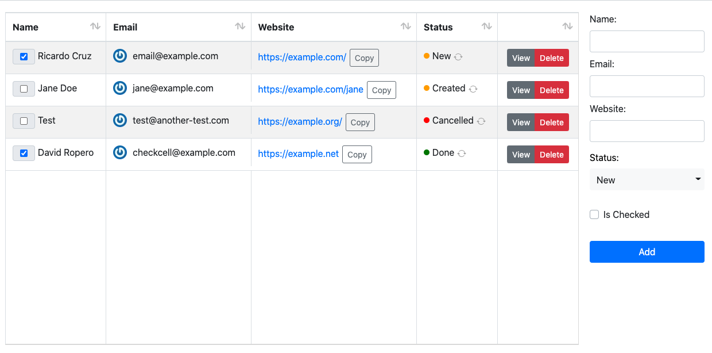

# Cell Renderers for your next Xojo Web 2 project

Enhance your WebListView controls using these cell renderers.


## Installation
1. Clone or download this repository
2. Open CustomCellRenderers.xojo_project with [Xojo](https://www.xojo.com/)
3. Drag & Drop `Cell Renderers` folder into your project
4. Done!, you can use them already!

## Usage
You can open the project itself as an example, it contains a simple web page with the working code.

## Available Cell Renderers and code Examples

### GravatarCellRenderer
```vb
Var email As String = "example@example.com"
Var caption As String = "Jane Doe"
list.CellValueAt(row, column) = New GravatarCellRenderer(email, caption)
```

### StatusCellRenderer
```vb
Var state As StatusCellRenderer.States = StatusCellRenderer.States.Healthy
list.CellValueAt(row, column) = New StatusCellRenderer(state, "OK", True)
' Set last parameter to False to disable refresh button
```

You can listen to the CustomCellAction event waiting for clicks on the refresh button, the `identifier` will be `StatusRefreshButtonPressed`.

```vb
If identifier = "StatusRefreshButtonPressed" Then
  MessageBox("Refresh has been pressed!")
End If
```

### TextWithCopyButtonCellRenderer
```vb
Var token As String = "ABCDEFGH9876"
list.CellValueAt(row, column) = New TextWithCopyButtonCellRenderer(token, False)

' If the text is a URL, you can convert it to a link by passing True as a second parameter (defaults to False)
Var url As String = "https://en.rcruz.es/"
list.CellValueAt(row, column) = New TextWithCopyButtonCellRenderer(url, True)
```

### GroupButtonsCellRenderer
```vb
Var buttons() As GroupButtonItem
buttons.Add(New GroupButtonItem("view", "View"))
buttons.Add(New GroupButtonItem("delete", "Delete", "danger"))
list.CellValueAt(row, column) = New GroupButtonsCellRenderer(buttons)
```

The third parameter could be one of the color utilities of [Bootstrap](https://getbootstrap.com/docs/5.1/components/buttons/) (defaults to `secondary`):   
`primary`, `secondary`, `success`, `danger`, `warning`, `info`, `light`, `dark` or `link`.

You can listen to the CustomCellAction event waiting for clicks on the refresh button, the `identifier` will be `GroupButtonPressed`, while the `value` will be the first parameter.

```vb
If identifier = "GroupButtonPressed" Then
  Select Case value
  Case "view"
    MessageBox("View button has been pressed")
  Case "delete"
    Me.RemoveRowAt(row)
  End Select
End If
```
### CheckCellRender
```vb
Var caption As String = "Hello, this is the caption value"
Var checked As Boolean = True
list.CellValueAt(row,column) = New CheckCellRender(caption,checked)
list.CellTagAt(row,column) = checked
```
You can listen to the CustomCellAction event waiting for clicks on the check, the `identifier` will be `CheckPressed`.  while the `value` will be the boolean checked value.

If you need to access the caption value of the cell, you will have to create a CheckCellRender class object and access its properties.
Anyway, for each change in the checkbox, it will be necessary to create a new cell with the value of the opposite check.

```vb
If identifier = "CheckPressed" Then
  Var checkCell As CheckCellRender = Me.CellTextAt(row,column)
  Me.CellValueAt(row,column) = New CheckCellRender(checkCell.Caption, Not checkCell.Checked)
  Me.CellTagAt(row, column) = Not checkCell.Checked
End If
```
